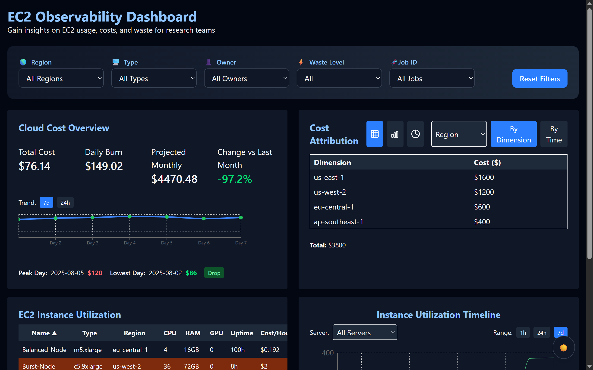
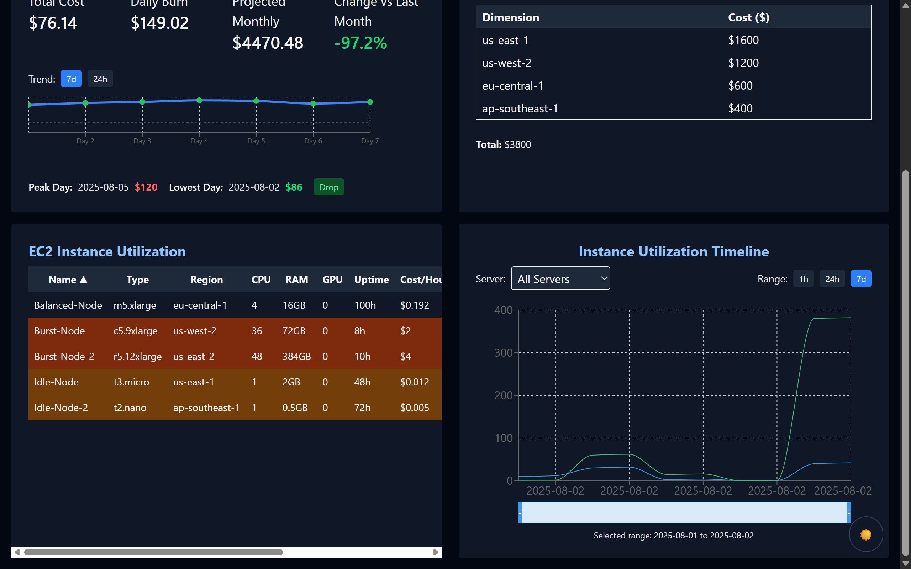

# EC2 Observability Dashboard

A cloud-native dashboard for visualizing EC2 server utilization, cost attribution, and waste, designed for bioinformaticians and technical teams in research-intensive fields.

## Table of Contents

- [Overview](#overview)
- [Features](#features)
- [Tech Stack](#tech-stack)
- [Project Structure](#project-structure)
- [Setup & Usage](#setup--usage)
- [Component Details](#component-details)
- [Design Decisions & Tradeoffs](#design-decisions--tradeoffs)
- [Screenshots](#screenshots)
- [License](#license)

---

## Overview

This prototype helps users explore, interpret, and act on EC2 server utilization and cost patterns. It enables smarter infrastructure decisions without deep cloud expertise, supporting life sciences and research teams.

---

## Features

- **EC2 Instance Utilization Table**: Sort, filter, and flag underused/over-provisioned servers.
- **Cost Attribution Panel**: Break down costs by region, instance type, team, or job ID; toggle between table, bar, and pie charts.
- **Live Cloud Cost Overview**: View total cost, daily burn rate, projected monthly spend, and trends.
- **Utilization Timeline Graph**: Inspect CPU, RAM, GPU usage for any server over 1h, 24h, or 7d.
- **Custom Filtering Layer**: Filter dashboard by region, type, owner, waste level, or job ID; reset filters easily.
- **Responsive UI**: Modern, accessible design with dark mode support.

---

## Tech Stack

- **Framework**: Next.js (React)
- **Language**: TypeScript
- **Styling**: Tailwind CSS, PostCSS
- **Charts**: Recharts
- **Testing**: Jest, React Testing Library
- **Containerization**: Docker, Docker Compose

---

## Project Structure

```
components/         # UI components (tables, panels, charts, filters)
lib/                # Context providers (AppContext, ThemeContext)
mock-data/          # Simulated EC2, cost, and utilization data
pages/              # Next.js pages and API routes
styles/             # Global styles (Tailwind)
__tests__/          # Unit tests for components
Dockerfile          # Production container build
docker-compose.yml  # Local orchestration
```

---

## Setup & Usage

### Prerequisites

- Node.js 20+
- pnpm or npm
- Docker (optional, for containerized run)

### Local Development

```bash
pnpm install
pnpm dev
```

Visit [http://localhost:3000](http://localhost:3000).

### Run with Docker

```bash
docker-compose up --build
```

---

## Component Details

### 1. EC2 Instance Utilization Table

- Displays EC2 instances with CPU, RAM, GPU, uptime, cost/hour, job ID.
- Flags underused (low CPU, high uptime) and over-provisioned (high CPU, low usage) servers.
- Supports sorting and filtering by region, type, owner, job ID, and waste level.

### 2. Cost Attribution Panel

- Breaks down costs by metadata (region, type, team, job ID).
- Toggle between table, bar chart, and pie chart views.
- Shows total, attributed, and unaccounted costs.
- Compare across dimensions and time ranges.

### 3. Live Cloud Cost Overview

- KPIs: total cost, daily burn, projected monthly spend, change vs last month.
- Trend chart (7d/24h) with visual cues for spikes/drops.
- Peak and lowest day highlights.

### 4. Utilization Timeline Graph

- Visualizes CPU, RAM, GPU usage for selected server.
- Toggle time range (1h, 24h, 7d).
- Annotates idle/spiky behavior.

### 5. Custom Filtering Layer

- Filters for region, type, owner, waste level, job ID.
- Applies filters across all dashboard components.
- Reset filters with one click.

---

## Design Decisions & Tradeoffs

- **UX Tradeoff**: Table layout prioritizes clarity over compactness; waste logic is simplified for demo.
- **Assumptions**: "Waste" is defined as underused (low CPU, high uptime) or over-provisioned (high CPU, low usage).
- **Feature Not Built**: Real-time AWS API integration; simulated data used for demo and assessment.
- **Accessibility**: All controls are keyboard-accessible; color cues support dark mode.

---

## Screenshots

### Dashboard Overview


### Cost Attribution Panel


---

## License

MIT

---

**Contact:** For questions or feedback, email xyz@tracer.cloud.

---
