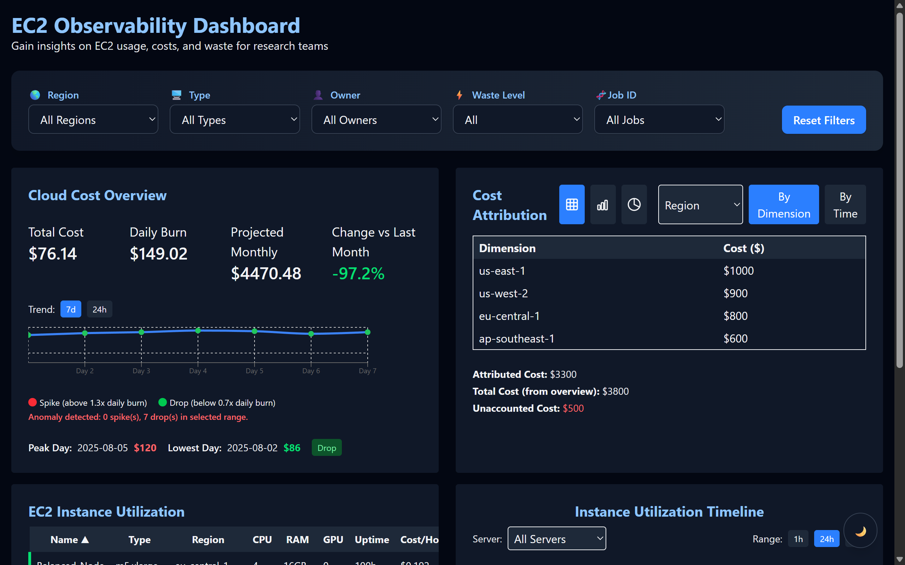
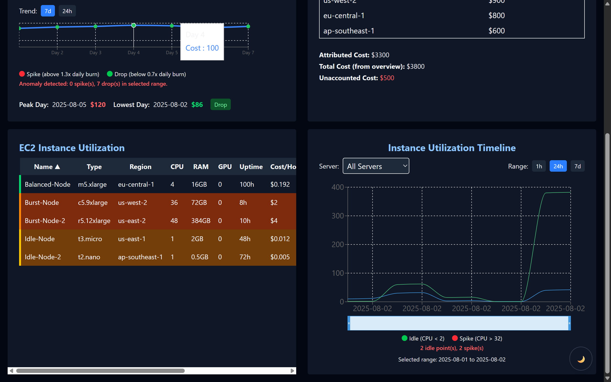

# EC2 Observability Dashboard

A cloud-native dashboard for visualizing EC2 server utilization, cost attribution, and waste, designed for bioinformaticians and technical teams in research-intensive fields. Now features advanced filtering, interactive charts, and mock API routes for demo/testing.

## Table of Contents

- [Overview](#overview)
- [Features](#features)
- [Tech Stack](#tech-stack)
- [Project Structure](#project-structure)
- [Setup & Usage](#setup--usage)
- [Component Details](#component-details)
- [Design Decisions & Tradeoffs](#design-decisions--tradeoffs)
- [Screenshots](#screenshots)
- [License](#license)

---

## Overview

This prototype helps users explore, interpret, and act on EC2 server utilization and cost patterns. It enables smarter infrastructure decisions without deep cloud expertise, supporting life sciences and research teams.

---


## Features

- **EC2 Instance Utilization Table**: Sort, filter, and flag underused/over-provisioned servers. Waste logic: Underused (low CPU, high uptime), Over-provisioned (high CPU, low usage).
- **Cost Attribution Panel**: Break down costs by region, instance type, team, or job ID; toggle between table, bar, and pie charts. Compare by dimension or time series.
- **Live Cloud Cost Overview**: View total cost, daily burn rate, projected monthly spend, and trends. Detect spikes/drops with visual cues.
- **Utilization Timeline Graph**: Inspect CPU, RAM, GPU usage for any server over 1d, 7d, or 14d. Annotate idle/spiky behavior, select server and time range interactively.
- **Custom Filtering Layer**: Filter dashboard by region, type, owner, waste level, or job ID. All filters persist in localStorage and apply across all components. Reset filters easily.
- **Theme Toggle**: Floating button for dark/light mode, persists user preference.
- **API Routes (Mock Data)**: `/api/ec2-instances`, `/api/costs`, `/api/utilization` serve demo data for all components.
- **Responsive UI**: Modern, accessible design with dark mode support.

---


## Tech Stack

- **Framework**: Next.js (React)
- **Language**: TypeScript
- **Styling**: Tailwind CSS, PostCSS
- **Charts**: Recharts
- **Animation**: Framer Motion
- **Testing**: Jest, React Testing Library
- **Containerization**: Docker, Docker Compose

---


## Project Structure

```
components/         # UI components (tables, panels, charts, filters, theme toggle)
lib/                # Context providers (AppContext: filters, ThemeContext: dark mode)
mock-data/          # Simulated EC2, cost, and utilization data
pages/              # Next.js pages and API routes (costs, ec2-instances, utilization)
styles/             # Global styles (Tailwind)
__tests__/          # Unit tests for all components
Dockerfile          # Production container build
docker-compose.yml  # Local orchestration
```

---


## Setup & Usage

### Prerequisites

- Node.js 20+
- pnpm or npm
- Docker (optional, for containerized run)

### Local Development

```bash
pnpm install
pnpm dev
```

Visit [http://localhost:3000](http://localhost:3000).

### Run with Docker

```bash
docker-compose up --build
```

### API Endpoints (Demo)
- `/api/ec2-instances` — returns mock EC2 instance data
- `/api/costs` — returns mock cost overview and attribution
- `/api/utilization` — returns mock utilization time series

---


## Component Details

### 1. EC2 Instance Utilization Table
- Displays EC2 instances with CPU, RAM, GPU, uptime, cost/hour, job ID.
- Flags underused (low CPU, high uptime) and over-provisioned (high CPU, low usage) servers.
- Sorting and filtering by region, type, owner, job ID, and waste level. Filter state persists in localStorage.
- Waste status is visually highlighted (color, icon, border).

### 2. Cost Attribution Panel
- Breaks down costs by metadata (region, type, owner/team, job ID).
- Toggle between table, bar chart, and pie chart views.
- Compare by dimension or time series (if available).
- Shows total, attributed, and unaccounted costs (difference from overview).
- Interactive controls for dimension and comparison type.

### 3. Live Cloud Cost Overview
- KPIs: total cost, daily burn, projected monthly spend, change vs last month.
- Trend chart (7d/24h) with visual cues for spikes/drops (anomaly detection).
- Peak and lowest day highlights, summary of anomalies.

### 4. Utilization Timeline Graph
- Visualizes CPU, RAM, GPU usage for selected server and time range (1d, 7d, 14d).
- Annotates idle (CPU < 2) and spiky (CPU > 32) behavior with color cues.
- Interactive server selection and time range brush.
- Displays summary of idle/spiky points and selected range.

### 5. Custom Filtering Layer
- Filters for region, type, owner, waste level, job ID.
- All filters apply globally and persist in localStorage.
- Reset filters with one click. Active filters shown as chips/tags.

### 6. Theme Toggle
- Floating button for dark/light mode, persists user preference.

### 7. API Routes (Demo)
- `/api/ec2-instances`, `/api/costs`, `/api/utilization` serve mock data for all components.

---


## Design Decisions & Tradeoffs

- **UX Tradeoff**: Table layout prioritizes clarity over compactness; waste logic is simplified for demo.
- **Assumptions**: "Waste" is defined as underused (low CPU, high uptime) or over-provisioned (high CPU, low usage).
- **Feature Not Built**: Real-time AWS API integration; simulated data used for demo and assessment.
- **Accessibility**: All controls are keyboard-accessible; color cues support dark mode.
- **State Management**: Filters and theme persist in localStorage for user convenience.
- **Testing**: All major components have Jest/RTL unit tests.

---


## Screenshots

### Dashboard Overview




---


## License

MIT

---

**Contact:** For questions or feedback, email xyz@tracer.cloud.

---
